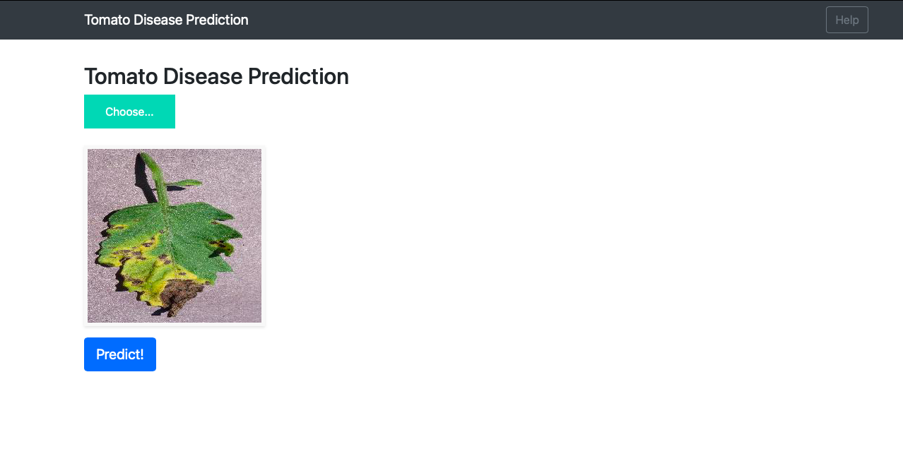
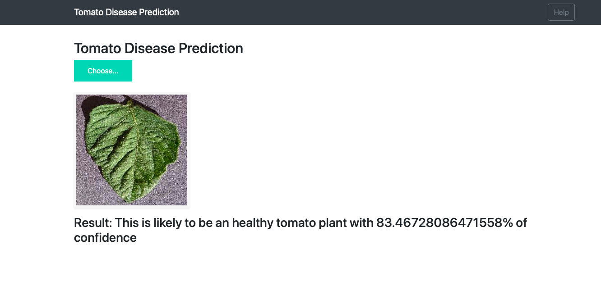
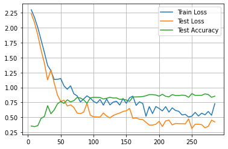

# Tomato-Disease-Prediction-End-to-End-Application

- This is an end-to-end ML Project to classify 9 different types of diseases of Tomato Plants

1. Bacterial Spot
2. Early Blight
3. Late Blight
4. Leaf Mold
5. Septoria Leaf Spot
6. Spider mites
7. Target Spot
8. Tomato yellow leaf curl virus
9. Tomato Mosaic virus
10. Healthy

### Previews

##### Preivew-1

##### Preview-2

### Training
I used Densenet121 to train the model
- Below is the graph of training loss and accuracy

